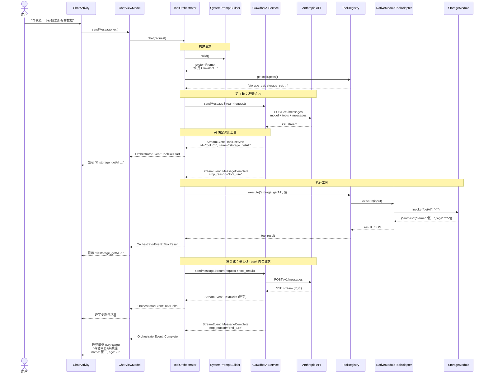
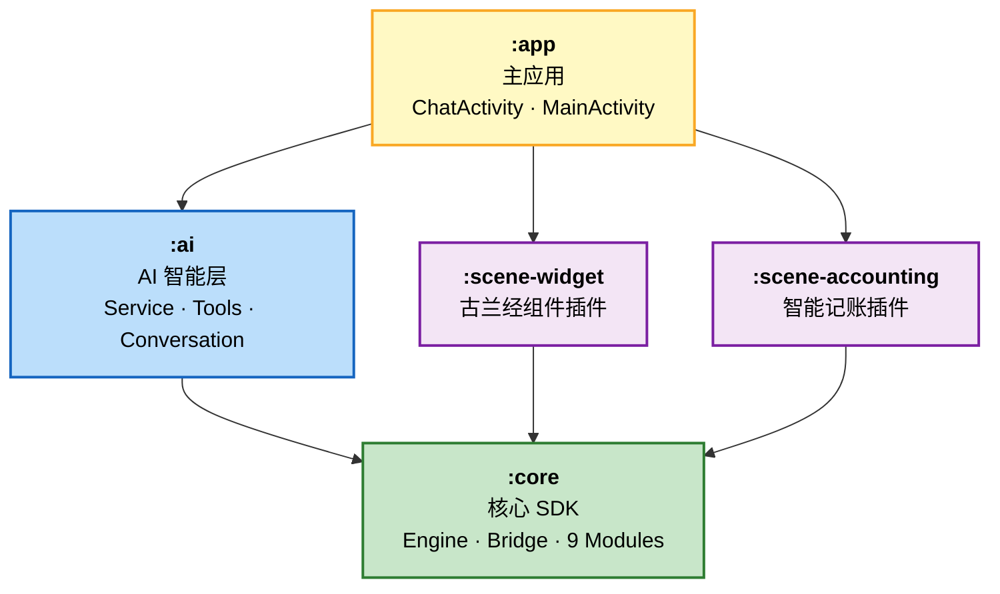
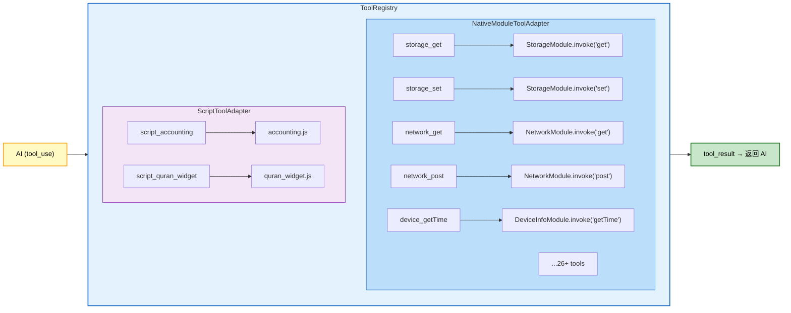
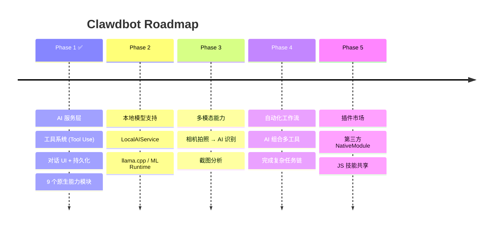

# Clawdbot — AI Agent on Your Phone

> 把大语言模型的"大脑"装进 Android 手机，让 AI 像你一样操作手机。

Clawdbot 是一个运行在 Android 端的 **AI Agent 框架**。它不只是一个聊天机器人——它能**看到、理解、并操作**你手机上的数据和能力。当你说"帮我记一笔午饭 30 块"，AI 不是回复一段文字，而是真的打开数据库、创建记录、返回确认。

---

## 核心理念

```mermaid
graph LR
    subgraph 传统 AI 聊天
        direction LR
        U1["用户"] --> A1["AI"] --> R1["文字回复"]
    end

    subgraph Clawdbot
        direction LR
        U2["用户"] --> A2["AI 思考"] --> T["调用工具"] --> D["操作手机"] --> R2["回复结果"]
    end

    style 传统 AI 聊天 fill:#FFEBEE,stroke:#C62828
    style Clawdbot fill:#E8F5E9,stroke:#2E7D32
    style T fill:#BBDEFB,stroke:#1565C0,color:#000
    style D fill:#FFF9C4,stroke:#F9A825,color:#000
```

**关键区别**：AI 不再只是"说"，而是能"做"。每一个原生能力都是 AI 的一只"手"。

---

## 系统架构

### 全局视图

```mermaid
block-beta
    columns 3

    block:APP:3
        columns 3
        space:3
        A["<b>Clawdbot App</b>"]:3
        space:3

        block:MAIN
            columns 1
            MA["<b>MainActivity</b>"]
            MB["脚本卡片列表\nWidget Demo\n记账 Demo"]
            MC["[ FAB ]"]
        end

        space

        block:CHAT
            columns 1
            CA["<b>ChatActivity</b>"]
            CB["消息列表 (Markwon)\n+ 输入栏"]
            CC["ChatViewModel"]
        end

        space:3
    end

    block:AI:3
        columns 3
        space:3
        AI_TITLE["<b>AI 层 · :ai module</b>"]:3
        space:3

        block:ORCH:3
            columns 1
            OA["<b>ToolOrchestrator</b>"]
            OB["用户消息 → AI 请求 → 响应分析 → 需要工具？"]
            OC["是 tool_use → 执行工具 → 发回结果 → 再次请求 AI（最多 10 轮）\n否 end_turn → 返回文本响应"]
        end

        space:3

        block:SVC
            columns 1
            SA["<b>ClawdbotAIService</b>"]
            SB["OkHttp SSE\nAnthropic API\n流式输出"]
        end

        space

        block:REG
            columns 1
            RA["<b>ToolRegistry</b>"]
            RB["storage_get · network_post\ndatabase_query · device_getTime\nfile_readText · alarm_setReminder\nclipboard_getText · ..."]
        end

        space:3
    end

    block:CORE:3
        columns 3
        space:3
        CORE_TITLE["<b>核心层 · :core module</b>"]:3
        space:3

        block:MODULES:3
            columns 4
            M_TITLE["<b>NativeModule 接口</b>"]:4
            m1["Storage\nModule"]
            m2["Network\nModule"]
            m3["Database\nModule"]
            m4["Device\nInfo"]
            m5["Clipboard\nModule"]
            m6["Notification\nModule"]
            m7["File\nModule"]
            m8["Alarm\nModule"]
        end

        space:3

        block:ENGINE:3
            columns 1
            EA["<b>WebView JS Engine</b>"]
            EB["JS 脚本 ⇄ __bridge.invoke() ⇄ BridgeDispatcher"]
        end

        space:3
    end

    MC --> CA
    CC --> OA
    OA --> SA
    OA --> RA
    RA --> M_TITLE

    style APP fill:#FFF8E1,stroke:#F9A825
    style AI fill:#E3F2FD,stroke:#1565C0
    style CORE fill:#E8F5E9,stroke:#2E7D32
    style ORCH fill:#BBDEFB,stroke:#1565C0
    style SVC fill:#BBDEFB,stroke:#1565C0
    style REG fill:#BBDEFB,stroke:#1565C0
    style MODULES fill:#C8E6C9,stroke:#2E7D32
    style ENGINE fill:#C8E6C9,stroke:#2E7D32
    style MAIN fill:#FFF9C4,stroke:#F9A825
    style CHAT fill:#FFF9C4,stroke:#F9A825
```



### AI 对话流程



### 模块依赖关系



### 工具适配架构



> **映射规则**：每个 `NativeModule` 的每个 `method` = 一个独立 Tool，命名 `{moduleName}_{method}`。
> 每个 Tool 由 `ToolDefinition`（name + description + JSON Schema）和 `ToolExecutor`（execute(input)）组成。

---

## 为什么叫 Clawdbot？

**Claw** (爪子) + **Bot** (机器人) = 一只有爪子的 AI 机器人。

传统 AI 只有"嘴巴"（能说），Clawdbot 有"爪子"（能做）。它能抓取数据、操作存储、发送通知、设置闹钟——像一双灵巧的爪子操控你的手机。

当然，它的名字也致敬了为它提供智慧的 Claude。

---

## 当前能力矩阵

### 设备能力（NativeModule → AI Tool）

| 能力域 | 模块 | AI 工具 | 说明 |
|--------|------|---------|------|
| **数据存储** | StorageModule | `storage_get` `storage_set` `storage_remove` `storage_getAll` `storage_has` `storage_keys` | SharedPreferences 键值存储 |
| **数据库** | DatabaseModule | `database_exec` `database_query` `database_listTables` `database_describeTable` | 通用 SQLite，AI 可自行建表查询 |
| **网络请求** | NetworkModule | `network_get` `network_post` `network_put` `network_delete` | 完整 HTTP 客户端 |
| **文件系统** | FileModule | `file_readText` `file_writeText` `file_listFiles` `file_delete` | App 沙箱内文件操作 |
| **剪贴板** | ClipboardModule | `clipboard_getText` `clipboard_setText` | 系统剪贴板读写 |
| **设备信息** | DeviceInfoModule | `device_getInfo` `device_getTime` `device_getConnectivity` | 型号、时间、网络状态 |
| **通知** | NotificationModule | `notification_show` | 本地推送通知 |
| **闹钟** | AlarmModule | `alarm_setAlarm` `alarm_setReminder` | 精确闹钟和延时提醒 |
| **语音** | VoiceModule | `voice_isAvailable` `voice_startListening` | 语音识别输入 |
| **桌面组件** | WidgetModule | `widget_updateText` | 更新 AppWidget |

### 脚本技能（JS Script → AI Tool）

| 技能 | 脚本 | 说明 |
|------|------|------|
| 智能记账 | `accounting.js` | 自然语言解析账单，自动分类 |
| 古兰经组件 | `quran_widget.js` | 每日经文推送到桌面 |

---

## 使用场景示例

### 场景 1：智能数据助手

```
👤 "帮我在数据库里建一张通讯录表，存几个联系人"

🤖 思考: 需要执行 SQL 建表和插入数据
   ⚙ database_exec → CREATE TABLE contacts(id INTEGER PRIMARY KEY, name TEXT, phone TEXT)
   ⚙ database_exec → INSERT INTO contacts VALUES(1, '张三', '13800138000')
   ⚙ database_exec → INSERT INTO contacts VALUES(2, '李四', '13900139000')

   "已经创建好通讯录表并添加了2个联系人：
   | 姓名 | 电话 |
   |------|------|
   | 张三 | 13800138000 |
   | 李四 | 13900139000 |"
```

### 场景 2：设备状态检查

```
👤 "现在什么情况？"

🤖 思考: 用户想了解设备状态
   ⚙ device_getTime → {"formatted": "2024-01-15 14:30:00", "timezone": "Asia/Shanghai"}
   ⚙ device_getConnectivity → {"connected": true, "type": "wifi"}
   ⚙ device_getInfo → {"model": "Pixel 7", "osVersion": "14"}

   "现在是 2024年1月15日 14:30，你的 Pixel 7 (Android 14) 正通过 WiFi 联网，一切正常。"
```

### 场景 3：快捷操作

```
👤 "5分钟后提醒我开会"

🤖 思考: 设置一个延时提醒
   ⚙ alarm_setReminder → {"delayMinutes": 5, "message": "开会时间到了"}

   "好的，已设置5分钟后提醒你开会。"
```

### 场景 4：网络查询

```
👤 "帮我请求一下这个 API: https://api.example.com/weather?city=beijing"

🤖 思考: 发送 HTTP 请求
   ⚙ network_get → {"url": "https://api.example.com/weather?city=beijing"}

   "请求结果: 北京今天晴，气温 -2°C ~ 8°C，北风3级。"
```

---

## 技术栈

| 层级 | 技术 | 说明 |
|------|------|------|
| **AI 推理** | Claude API (Anthropic) | SSE 流式输出 + tool_use 函数调用 |
| **网络通信** | OkHttp + OkHttp-SSE | HTTP 请求 + Server-Sent Events |
| **JS 引擎** | Android WebView | 兼容性最优的 JS 执行环境 |
| **序列化** | kotlinx.serialization | 全链路 JSON 序列化 |
| **持久化** | Room (对话) + SQLite (通用) + SharedPreferences (KV) | 多层存储方案 |
| **安全** | EncryptedSharedPreferences | API Key 加密存储 |
| **UI** | Material Components + Markwon | Material Design + Markdown 渲染 |
| **异步** | Kotlin Coroutines + Flow | 结构化并发 |

---

## 项目结构

```
Clawdbot/
├── core/                          # 核心 SDK（独立，零外部依赖）
│   ├── engine/                    #   WebView JS 引擎
│   ├── bridge/                    #   JS ↔ 原生桥接
│   ├── modules/                   #   9 个原生能力模块
│   └── plugin/                    #   插件接口
│
├── ai/                            # AI 智能层（依赖 core）
│   ├── service/                   #   AI 服务抽象 + Clawdbot 实现
│   ├── model/                     #   对话数据模型
│   ├── tools/                     #   工具注册 / 适配 / 编排
│   ├── conversation/              #   对话管理 + System Prompt
│   └── persistence/               #   Room 对话持久化
│
├── scene-widget/                  # 古兰经桌面组件插件
├── scene-accounting/              # 智能记账插件
│
└── app/                           # 主应用
    ├── demo/                      #   ClawdbotApplication + MainActivity
    └── chat/                      #   ChatActivity + ViewModel + Adapter
```

---

## 设计哲学

### 1. 原生只提供能力，不承载逻辑

原生代码是 AI 的"身体"——提供眼睛（读取）、手（操作）、嘴巴（通知）。所有决策和业务逻辑由 AI 大脑或 JS 脚本承载。新增能力只需实现 `NativeModule` 接口。

### 2. 每个方法都是一个工具

`NativeModule` 的每个 `method` 自动映射为一个 AI 可调用的 Tool。命名规则 `{module}_{method}`，配合 JSON Schema 描述参数。AI 看到工具列表就知道自己能做什么。

### 3. JS 脚本是高级技能

已有的 JS 脚本不会被废弃，而是升级为 AI 可调用的"技能"。AI 可以说："这个任务需要记账，让我调用记账技能"，然后执行 `accounting.js`。

### 4. 流式优先

所有 AI 响应都通过 SSE 流式传输，逐字显示。工具调用过程实时展示（"正在调用 storage_getAll..."），让用户看到 AI 的"思考过程"。

### 5. 安全边界

- 文件操作限制在 App 沙箱内，路径遍历攻击被阻断
- 数据库表名经过正则清洗
- API Key 使用 AES-256 加密存储
- 工具循环上限 10 轮，防止无限调用

---

## 未来路线图



---

## 快速开始

```bash
# 构建
./gradlew assembleDebug

# 安装到设备
./gradlew installDebug

# 打开 App → 点击右下角 FAB → 输入 API Key → 开始对话
```

---

*Clawdbot — 不只是聊天，是行动。*
